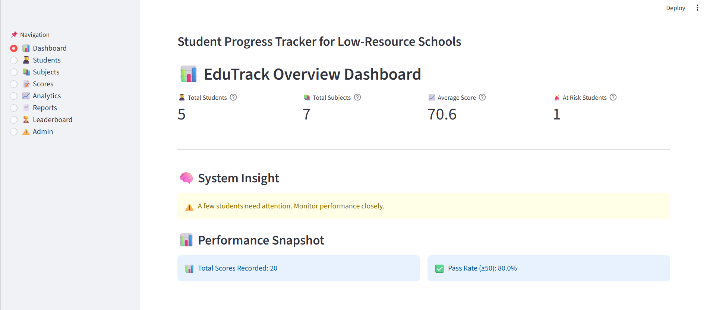
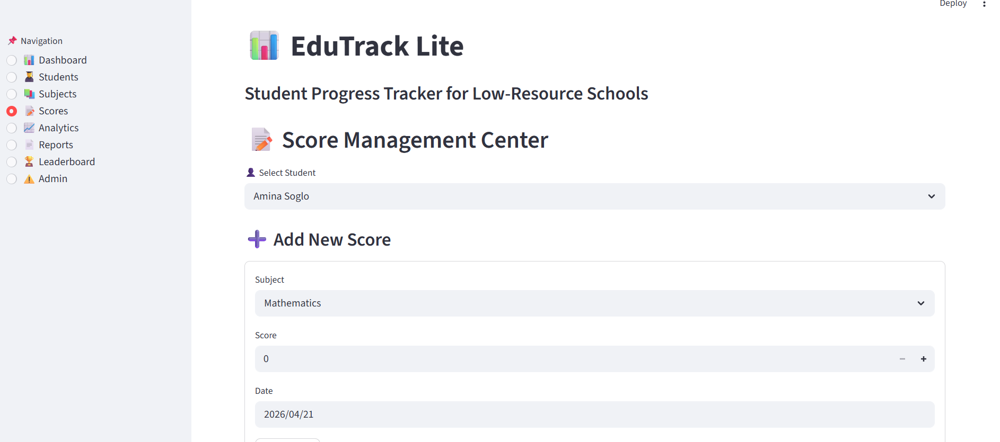
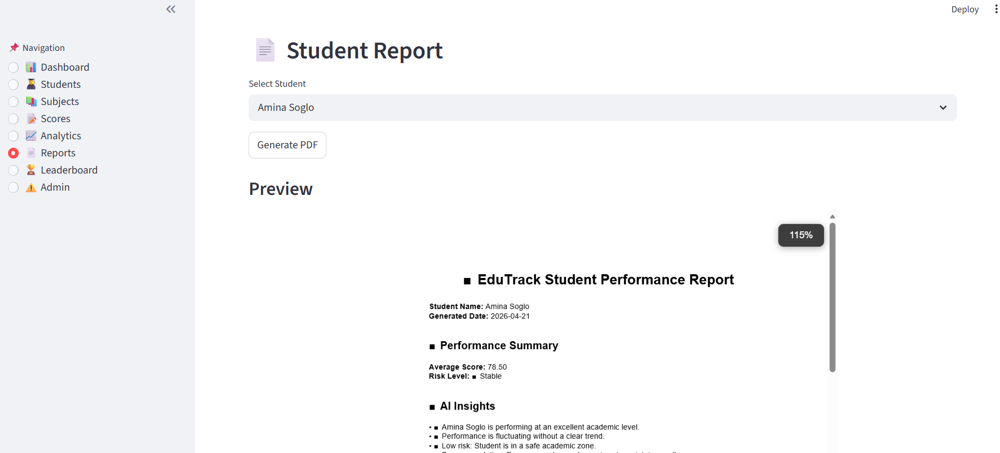
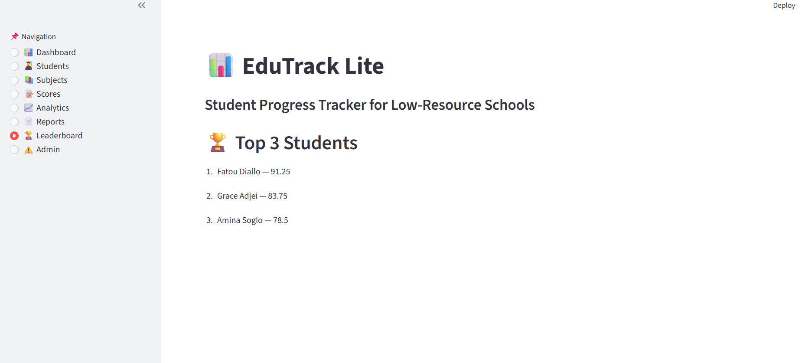

# 📊 EduTrack Lite

🚀 **Live App:** https://edutrack-lite-fadil-ade.streamlit.app/

EduTrack Lite is a **student performance tracking system** designed for low-resource schools.  
It helps teachers manage students, subjects, scores, analytics, and generate PDF reports in real time.

---

## ✨ Features

- 👨‍🎓 Student management (add/delete students)
- 📚 Subject management with protection system
- 📝 Score tracking per student and subject
- 📊 Performance analytics (average, trends, pass rate)
- 🚨 Risk detection (students needing attention)
- 🏆 Leaderboard (top students ranking)
- 📄 PDF report generation (individual + full school)
- 🧠 Smart insights for student performance
- 🗑️ Safe delete system with confirmations

---

## 🖥️ Live Demo

https://edutrack-lite-fadil-ade.streamlit.app/

---

## 📸 Screenshots

### 📊 Dashboard

### 📝 Scores Management

### 📄 Reports Generation

### 🏆 Leaderboard

---

## 🧠 System Architecture

- Frontend: Streamlit  
- Backend: Python  
- Database: SQLite  
- Reports: PDF generation module  
- Analytics: Custom performance engine  

---

## 📂 Project Structure

edutrack-lite/  
│  
├── app.py  
├── database/  
│   ├── db.py  
│   └── queries.py  
│  
├── modules/  
│   ├── students.py  
│   ├── performance.py  
│   ├── analytics.py  
│   ├── ai_insights.py  
│   └── report.py  
│  
├── screenshots/  
│   ├── dashboard.png  
│   ├── scores.png  
│   ├── reports.png  
│   └── leaderboard.png  
│  
└── edutrack.db  

---

## 🎯 Key Highlights

- Built for real-world education environments  
- Works offline with SQLite  
- Designed for low-resource schools  
- Strong focus on data-driven decision making  

---

## 👨‍💻 Author

Fadil Owolara ADELABOU

Software Development Student | Future Cybersecurity Engineer  
GitHub: [edutrack-lite](https://github.com/available-pixel/edutrack-lite)

---

## 📌 License

This project is open-source and free to use for educational purposes.
